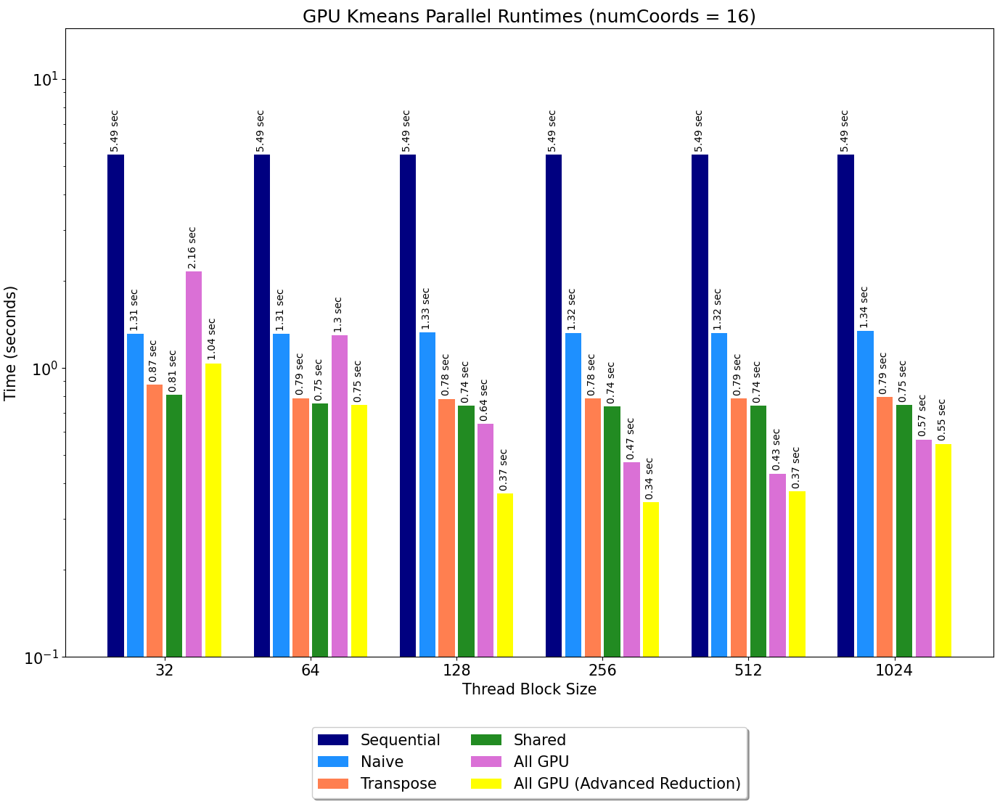
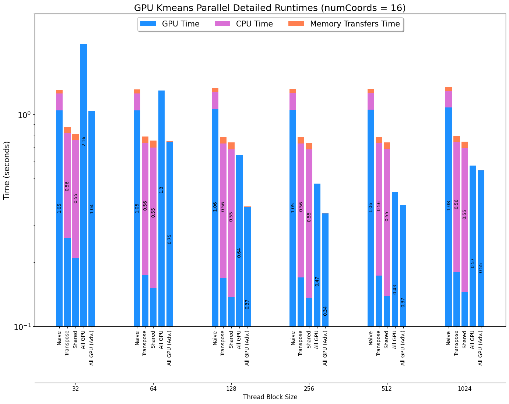

# Shared Memory K-Means

Parallel implementations of the K-Means algorithm, designed for a shared memory system. The experiments for this
exercise were facilitated on 4 8-core NUMA nodes (32 physical cores and up to 64 threads).

| Directory | Comment                                                 |
|-----------|---------------------------------------------------------|
| kmeans    | Code for the different versions of the parallel K-Means |
| plots     | Plots from the various experiments                      |

There are 4 different versions of the K-Means algorithm included in the _kmeans_ folder, along with auxiliary functions
and
tools. The parallel versions were implemented using OpenMP.
The following table highlights the differences between the included versions.

| File                                      | Comment                                                                            |
|-------------------------------------------|------------------------------------------------------------------------------------|
| cuda_kmeans_naive.cu                      | Naive approach for GPU parallelization                                             |
| cuda_kmeans_transpose.cu                  | Slightly better approach using transpose coordinates for more efficient memory use |
| cuda_kmeans_shared.cu                     | First implementation using the GPU's shared memory                                 |
| cuda_kmeans_all_gpuSharedMemory2D.cu      | A more advanced version that updates the centroids in parallel with reduction      |
| cuda_kmeans_all_gpuReduceParallelBlock.cu | Slight improvement on the  cuda_kmeans_all_gpuSharedMemory2D version               |

The sequential code-basis for these parallel implementations is identical to the one shown
in the [Shared Memory K-Means](../Shared%20Memory%20K-Means/README.md) exercise.

### [Naive GPU kmeans](kmeans/cuda_kmeans_naive.cu)

A first approach to parallelization, is matching the computation of _find_nearest_cluster_ for every object in the
do-while loop, to a thread. The kernel for to achieve this can be seen bellow.

```c
__global__ static void find_nearest_cluster(int numCoords,
                                            int numObjs,
                                            int numClusters,
                                            float *objects,       //  [numObjs][numCoords]
                                            float *deviceClusters,//  [numClusters][numCoords]
                                            int *deviceMembership,//  [numObjs]
                                            float *devdelta) {

  /* Get the global ID of the thread. */
  int tid = get_tid();
  // this could be also done with a Grid-Stride Loop
  if (tid < numObjs) {
    int index, i;
    float dist, min_dist;
    /* find the cluster id that has min distance to object */
    index = 0;
    // call euclid_dist_2 for objectId = tid
    min_dist = euclid_dist_2(numCoords, numObjs, numClusters, objects, deviceClusters, tid, 0);

    for (i = 1; i < numClusters; i++) {
      // call euclid_dist_2 for objectId = tid
      dist = euclid_dist_2(numCoords, numObjs, numClusters, objects, deviceClusters, tid, i);

      /* no need square root */
      if (dist < min_dist) { /* find the min and its array index */
        min_dist = dist;
        index = i;
      }
    }

    if (deviceMembership[tid] != index) {
      // use atomic operations to avoid errors
      atomicAdd(devdelta, 1.0);
    }

    /* assign the deviceMembership to object objectId */
    deviceMembership[tid] = index;
  }
}
```

As is evident, this resembles the parallelization of the  _numObjs_ for-loop, similarly to the naive shared memory
version. No GPU shared memory was used in this version, however other auxiliary functions like _euclid_dist_2_ were
defined, in order to be properly executed by the GPU.

Apart from the above, the full implementation using CUDA requires the appropriate memory copies as well as other
definitions of additional functions for the device and the host. These details for this and all the other versions
can be found in the corresponding files, mentioned in the table above.

### [Transpose GPU kmeans](kmeans/cuda_kmeans_transpose.cu)

To make better use of data-locality between neighbouring threads, this version transposes the _objects_
array, which is given in a _[numObjs][numCoords]_ layout and is transformed in a new _[numCoords][numObjs]_ layout.
This helps with performance, because when neighbouring threads execute computations on the iCoord of their objects, the
memory shared will now contain the iCoords of neighbouring objects (which are used by the neighbouring threads).

### [Shared GPU kmeans](kmeans/cuda_kmeans_shared.cu)

In this version, the GPU's shared memory is put into use. Namely, the array where the cluster centers are stored is
transferred into that shared memory, in order for all the threads to use it.

### [All GPU kmeans V1](kmeans/cuda_kmeans_all_gpuSharedMemory2D.cu)

In this version, the _find_nearest_cluster_ kernel uses GPU shared memory for the new cluster sizes array (apart
from the new clusters array which was added to the shared version above) and a new kernel
is implemented (_reduce_newClusterData_and_update_centroids_), in order to update the new clusters in parallel.
Before parallelization, this was done by the CPU using the code bellow.

```c
for (i = 0; i < numObjs; i++) {
  /* find the array index of nestest cluster center */
  index = membership[i];

  /* update new cluster centers : sum of objects located within */
  newClusterSize[index]++;
  for (j = 0; j < numCoords; j++)
    newClusters[j][index] += objects[i * numCoords + j];
}

/* average the sum and replace old cluster centers with newClusters */
for (i = 0; i < numClusters; i++) {
  for (j = 0; j < numCoords; j++) {
    if (newClusterSize[i] > 0)
      dimClusters[j][i] = newClusters[j][i] / newClusterSize[i];
    newClusters[j][i] = 0.0;   /* set back to 0 */
  }
  newClusterSize[i] = 0;   /* set back to 0 */
}
```

As is apparent, these for-loops include operations on both 1D and 2D arrays. To easily parallelize operations on the
latter (2D array) using a GPU, a 2D thread grid was used. Namely, the CUDA version for the above snippet is the
following:

```c
int iCluster = threadIdx.x + blockDim.x * blockIdx.x;
int iCoord = threadIdx.y + blockIdx.y * blockDim.y;
int iBlock;
for (iBlock = 0; iBlock < numClusterBlocks; iBlock++) {
  if (iCluster < numClusters) {
    shmemNewClusterSize[iCluster] += deviceLocalNewClusterSize[iBlock * numClusters + iCluster];
    if (iCoord < numCoords) {
      shmemNewClusters[numClusters * iCoord + iCluster] += deviceLocalNewClusters[iBlock * numClusters * numCoords +
                                                                                  iCoord * numClusters + iCluster];
    }
  }
}
__syncthreads();
// Update Centroids in Parallel
if (iCluster < numClusters) {
  if (iCoord < numCoords) {
    if (shmemNewClusterSize[iCluster] > 0) {
      deviceClusters[iCoord * numClusters + iCluster] =
              shmemNewClusters[iCoord * numClusters + iCluster] / shmemNewClusterSize[iCluster];
    }
  }
}
```
This kernel is executed by a single thread block, and it performs reduction on the values produced by the previous kernel,
using the shared memory. After the reduction, the new values are stored in an accessible location (_deviceClusters_) 
to be used in the next do-while iteration. 

As for the shared memory layouts, _find_nearest_cluster_ has the following

| numCoords * numClusters * sizeof(float) | numClusters * sizeof(int) |
|-----------------------------------------|---------------------------|
| newClusters                             | newClusterSize            |

and _reduce_newClusterData_and_update_centroids_:

| numCoords * numClusters * sizeof(float) | numCoords * numClusters * sizeof(float) | numClusters * sizeof(int) |
|-----------------------------------------|-----------------------------------------|---------------------------|
| deviceClusters                          | newClusters                             | newClusterSize            |


This implementation introduces a limitation. Specifically, the threδεν ad
block used to run the reduction can only include a maximum of 1024 threads (maximum threads per CUDA block),
meaning that the product _numClusters * numCoords_ has to be less than or equal to 1024. This could have been avoided by using
more thread blocks for this kernel, but in that case, the speedup that is brought with the use of a shared memory (shared
only between thread blocks), would have been lost.

### [All GPU kmeans V2](kmeans/cuda_kmeans_all_gpuReduceParallelBlock.cu)

One level of potential parallelization that is lost in the above kernel, lies in the reduction part. Namely, there need
to be _numClusterBlocks_ outer iterations in order for all the data from the previous kernel to be summed. Additionally,
one of the for-loops parallelized in the above version uses _numCoords_ threads, a number which is usually smaller than
_numClusterBlocks_. With all the above in mind, the _reduce_newClusterData_and_update_centroids_ kernel is broken into 
two, _reduce_newClusterData_ which doesn't use shared memory and _update_centroids_
which is similar to the second part of the previous kernel.

```c
__global__ static void reduce_newClusterData(int numCoords, int numClusters, int numClusterBlocks,
                                             int *deviceLocalNewClusterSize, float *deviceLocalNewClusters,
                                             float *deviceNewClusters, int *deviceNewClusterSize) {

  int iBlock = get_tid();
  int iCluster = threadIdx.y + blockDim.y * blockIdx.y;;
  int iCoord;
  if (iBlock < numClusterBlocks) {
    if (iCluster < numClusters) {
      atomicAdd(&deviceNewClusterSize[iCluster], deviceLocalNewClusterSize[iBlock * numClusters + iCluster]);
      for (iCoord = 0; iCoord < numCoords; iCoord++) {
        atomicAdd(&deviceNewClusters[numClusters * iCoord + iCluster],
                  deviceLocalNewClusters[iBlock * numClusters * numCoords + iCoord * numClusters + iCluster]);
      }
    }
  }
}


__global__ static void update_centroids(int numCoords, int numClusters,
                                        float *deviceClusters,
                                        float *deviceNewClusters, int *deviceNewClusterSize) {
  extern __shared__ float sharedMemory[];

  float *shmemNewClusters = &sharedMemory[0];
  int *shmemNewClusterSize = (int *) (sharedMemory + numClusters * numCoords);

  if (threadIdx.x == 0) {
    // Thread 0 of each block copies the Cluster Data to the shared memory
    memcpy(shmemNewClusterSize, deviceNewClusterSize, numClusters * sizeof(int));
    memcpy(shmemNewClusters, deviceNewClusters, numClusters * numCoords * sizeof(float));
  }

  int iCluster = get_tid();
  int iCoord = threadIdx.y + blockIdx.y * blockDim.y;
  // Update Centroids in Parallel
  if (iCluster < numClusters) {
    if (iCoord < numCoords) {
      if (shmemNewClusterSize[iCluster] > 0) {
        deviceClusters[iCoord * numClusters + iCluster] =
                shmemNewClusters[iCoord * numClusters + iCluster] / shmemNewClusterSize[iCluster];
      }
    }
  }
}
```

### Time Measurements and Plots



The above plot, shows the execution time for various thread block sizes. Especially for larger blocks, performance is
significantly improved as the implementations get more complex. This is to be expected, since the more complex versions
make better use of the available resources. One particular reason for the improvement of performnce in the all GPU
versions, is the minimization of CPU and Memory Transfers time which present a bottleneck. 
This can be seen in the following figure, which shows the different timers for all the parallel versions. 


